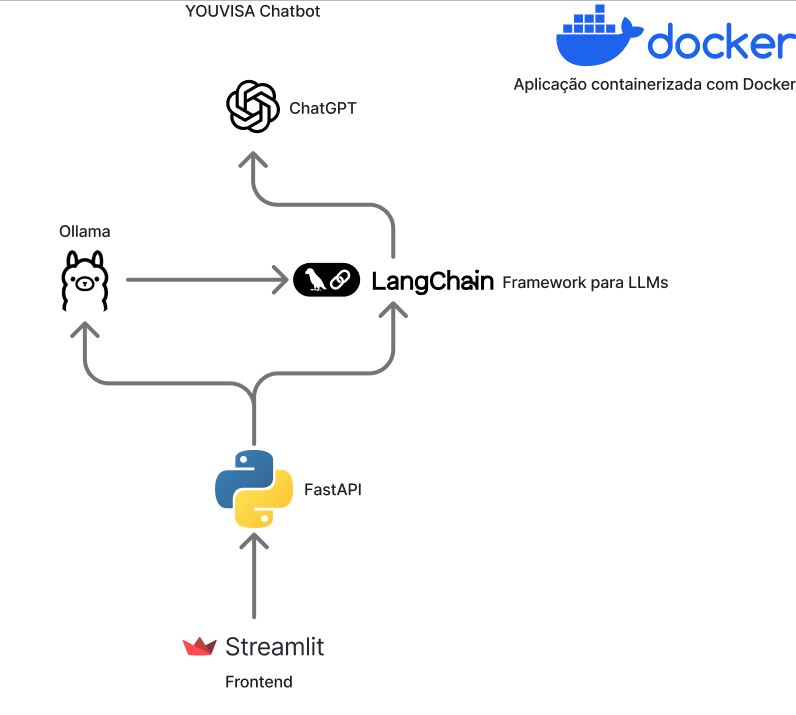

# YOUVISA_Chatbot

## FIAP - Faculdade de Informática e Administração Paulista

<p align="center">
<a href= "https://www.fiap.com.br/"></a>
</p>

<br>

# Nome do projeto

YouVisa Chatbot

## 👨‍🎓 Integrantes:

- <a href="https://www.linkedin.com/in/bryanjfagundes/">Bryan Fagundes</a>
- <a href="https://br.linkedin.com/in/brenner-fagundes">Brenner Fagundes</a>
- <a href="https://www.linkedin.com/in/diogo-botton-46ba49197/">Diogo Botton</a>
- <a href="https://www.linkedin.com/in/hyankacoelho/">Hyanka Coelho</a>
- <a href="https://www.linkedin.com/in/julianahungaro/">Juliana Hungaro Fidelis</a>

## 👩‍🏫 Professores:

### Tutor(a)

- <a href="https://www.linkedin.com/in/leonardoorabona?utm_source=share&utm_campaign=share_via&utm_content=profile&utm_medium=android_app">Leonardo Ruiz Orabona</a>

### Coordenador(a)

- <a href="https://www.linkedin.com/in/andregodoichiovato/">André Godoi</a>

## 📜 Descrição

O projeto tem como objetivo o desenvolvimento de um chatbot inteligente baseado em RAG (Retrieval-Augmented Generation) destinado à empresa YOUVISA, especializada em assessoria e realização de processos de visto. O objetivo principal é oferecer aos usuários um assistente virtual capaz de responder perguntas sobre vistos, reunindo informações de forma confiável a partir das próprias fontes oficiais da YOUVISA.

**O sistema foi projetado para:**

- Fornecer respostas precisas e atualizadas sobre temas relacionados a vistos;
- Recuperar conteúdo real de sites, blogs e materiais da YOUVISA;
- Restringir respostas apenas ao domínio para o qual foi treinado;
- Encaminhar o usuário a um canal humano quando a pergunta exigir atendimento especializado.

### Arquitetura da solução



A arquitetura é composta pelos seguintes componentes:

**Frontend – Streamlit**

- Interface simples e intuitiva para conversação.
- Envia mensagens e recebe respostas do backend.

**Backend – FastAPI**

- Responsável por gerenciar as requisições do chatbot.
- Exposição de endpoints para geração de respostas e para o pipeline de RAG.
- Comunicação direta com os módulos de embeddings, banco vetorial e LangChain.

**LangChain**

Framework que organiza o fluxo do RAG:

- Criação do retriever.
- Controle do prompting.
- Integração com o modelo de linguagem (OpenAI).
- Definição da política de domínio (permitir apenas temas relacionados a vistos).

**Ollama – Embeddings**

- Utilizado para gerar embeddings dos documentos coletados.
- Permite um processo de embedding local, reduzindo custos.
- Integração direta com Chroma.

**ChromaDB – Banco Vetorial**

- Armazena vetores dos documentos usados no RAG.
- Permite recuperação rápida e eficiente do contexto relevante.

**Docker – Containerização Completa**

Todos os serviços citados acima (Streamlit, FastAPI e Ollama) foram encapsulados em um ambiente Docker para subir todo o projeto em qualquer ambiente compatível.

### Funcionamento do Chatbot

O fluxo operacional do chatbot funciona da seguinte maneira:

**1. Usuário envia pergunta no Streamlit.**

**2. FastAPI recebe e interpreta a solicitação.**

**3. LangChain decide se:**
- Pergunta está dentro do domínio de vistos → processa via RAG;
- É muito específica (agenda, status, dados internos) → retornar contato do WhatsApp;
- Está fora do domínio → responder que não foi designado para esse tipo de pergunta.

**4. Se a pergunta é sobre vistos:**
- O retrieval realiza busca por similaridade no banco de dados vetorial (Chroma) para retornar trechos relevantes do conteúdo da YOUVISA;
- OpenAI gera uma resposta combinando o contexto recuperado;
- O chatbot responde com informação real extraída do material oficial.

### Conclusão

O projeto atinge o objetivo de entregar um assistente virtual seguro e contextualizado, capaz de apoiar usuários que buscam informações sobre vistos.
A arquitetura aliada à containerização com Docker, facilita manutenção, escalabilidade e implantação em diferentes ambientes.

Graças à abordagem RAG, o sistema fornece respostas confiáveis e atualizadas, mantendo fidelidade aos conteúdos oficiais da YOUVISA e garantindo que o chatbot:
- Responda apenas o que foi treinado para responder;
- Reconheça limites e direcione para canais humanos quando necessário;
- Possa ser expandido para novas fontes documentais no futuro.

## 📁 Estrutura de pastas

Dentre os arquivos e pastas presentes na raiz do projeto, definem-se:

- <b>assets</b>: Aqui estão os arquivos relacionados a elementos não-estruturados deste repositório, como imagens.

- <b>scripts</b>: Aqui está um arquivo de implementação (deploy), no caso, o docker-compose.yml que realiza o deploy da API juntamente com o frontend.

- <b>src/api</b>: API para funcionamento do Chatbot.

- <b>src/front</b>: Frontend para conversação com o Chatbot.

## 🔧 Como executar o código

Para executar a API com o chatbot, é necessário ter o Docker instalado em sua máquina e definir a variável de ambiente da chave de API da OpenAI. Crie um arquivo `.env` dentro do diretório `scripts` com a seguinte variável:

```bash
    OPENAI_API_KEY=sua-chave-da-open-ai-aqui
```

Com a chave configurada e o Docker instalado, basta com alguma CLI (por exemplo, o prompt do windows) navegar até a pasta `scripts` e digitar:

```bash
    docker-compose up -d --build
```

Ao rodar o comando, a API estará disponível com a documentação do Swagger através da url: `http://localhost/docs`. 

O Frontend estará disponível através da url `http://localhost:8501`.

## 📋 Licença

<p xmlns:cc="http://creativecommons.org/ns#" xmlns:dct="http://purl.org/dc/terms/"><a property="dct:title" rel="cc:attributionURL" href="https://github.com/agodoi/template">MODELO GIT FIAP</a> por <a rel="cc:attributionURL dct:creator" property="cc:attributionName" href="https://fiap.com.br">Fiap</a> está licenciado sobre <a href="http://creativecommons.org/licenses/by/4.0/?ref=chooser-v1" target="_blank" rel="license noopener noreferrer" style="display:inline-block;">Attribution 4.0 International</a>.</p>